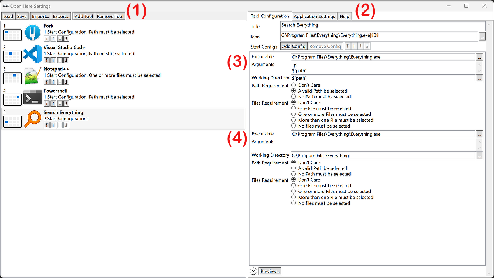

# Open Here Settings Application
The settings application provides a graphics user interface to edit the tools available in the [Toolbox Application](./toolbox_app.md).



**(1)** The left half of the window shows the list of configured tools.

You can `Load` and `Save` the tools from and to the system settings.
You can also `Import` and `Export` the tools configuration into an xml file, meant for archiving.
You can `Add` and `Remove` tools with the respective buttons at the top.

You can reorder the tools either by drag & drop, or using the respective arrow buttons on each tool.
The placement of the tools in the [Toolbox Application](./toolbox_app.md) window is determined by the order in this list.
The left-most icon of each tool visualized this placement.

The rest, the icon, the title and a short description, summarize the respective tool's configuration.

**(2)** The right half of the window shows the configuration of either the application or of the tool selected in the list (1).

You can specify any `Title` for each tool.
Multiple tools can have the same title, although this is not recommended, as it might confuse the user.

The `Icon` can either be specified by the text input control, or by using the browse button `[...]` on the right, which is recommended.

The main area of this right side shows  the list of start configurations, which specify the actions the select tool will perform.
The shown example has two start configurations: **(3)** and **(4)**.

You can `Add`, `Remove`, and reorder the start configurations, either by the four arrow buttons or via drag & drop.

Each start configuration has:
- `Executable` the full path to the executable file to be run when the tool is invoked.
- `Arguments` the list of command line arguments ([see `Macro Variables` below](#macro-variables)) to be passed to the tool.
  The list of arguments is here specified with **one argument per line**!
  While this might seem unintuitive, it helps to organize arguments in combination with macro variable replacement, and it removed the need for special treatment of whitespace characters within an argument (like surrounding quotes).
  The above example **(3)** specifies the argument list '`-p "${path}"`' as you would write it in most other applications.
- The `Working Directory` the executable will be started in.
- The `Path Requirement` and `Files Requirement` which will be used to select the first matching start configuration. ([see `Start Tool Requirements` below](#start-tool-requirements))

At the bottom of the window is a `Preview` button.
Clicking it will run the file explorer detection, will evaluate the selected tool, and will show a text output of how this tool will be started.

## Start Tool Requirements
Each tool start configuration can have requirements on whether or not a valid file system path needs to be open in the file explorer and whether or how many files need to be selected.

When a tool is invoked, the start configurations are evaluated in order from first to last.
The first start configuration which matches it's requirements to the status of the detected file explorer will be selected.
The respective command line will then be started.

### Path Requirement
For example: When the Microsoft Windows File Explorer is open and shows the local system, showing the local drives, the user's folders, connected network drives, etc., this is a virtual location, and not a valid file system location.
If the toolbox app is invoked now, it will show that the file explorer does not have a valid path opened.

### File Requirements
In the Microsoft Windows File Explorer the selected files are only detected on the right side of the explorer.
The directory selected on the left side is never included.

Note, that you can select non-files on the right side as well, e.g. folders.
Those will be filtered from the resulting list when running the Toolbox app.

## Macro Variables
When specifying the tools start configurations, you can use macro variables.
The variables can be used when specifying `Working Directory` (except for `${files}`) and `Arguments`.
Those will be replaced by dependent values when the tool will be invoked.
The following are the most useful macro variables:

- `${path}` -- this is the opened path
- `${file}` -- this is the full path to the first selected file.
  Note that the order of the selected files might be unintuitive.
  In the Microsoft Windows File Explorer it depends on the oder the files have been selected by the user.
- `${files}` -- this expands an repeats the argument for all selected files.
  See the examples below for details.

Example:

Assuming the detected file explorer has three files selected: `a.txt`, `b 2.txt`, and `c.mp3`.
Note the whitespace in the file name `b 2.txt`.

The start configuration of the selected tool specifies the executable `run.exe`, and the following argument list:
```
--files
-i=${files}
```

The resulting command line will be:
```ps
run.exe --files -i=a.txt "-i=b 2.txt" -i=c.mp3
```

The argument containing `${files}` is repeated for each file.
Only for `b 2.txt` the surrounding quotes are needed.
They are not added of the other arguments.

If you are trying to configure a complex conditional command line, and you hit limitations of what you can do with this syntax, I recommend using the [command line application](./console_app.md).
You can, for example, write a script file containing your logic based on the text output of the command line application.
Then you simply need to configure a tool for the Toolbox application, which starts your script interpret with your script.
