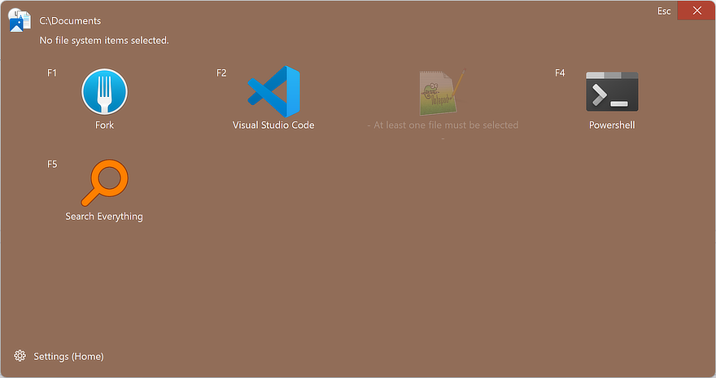

# Open Here Tool Box Application
The tool box application is the main window of the software.

The idea is to trigger `openhere.exe` by a quick access hardware button on the keyboard, like a macro key, to offer a choice of tools, depending on the state of an open file explorer.

The top line shows the path and selected files in the detected file explorer.

The center area of the window are twelve (4 by 3) tool buttons, showing the icon, the F hot key, and title of the configured tools.
Either click the icon or press the F hot key to start the respective tool.

If a tool is unavailable (third tool in this example), the icon will appear deemphasized and the hot key will not be shown.
Before the title a short text message will explain why the tool is unavailable.
In this case, the tool requires a file to be selected in the file explorer.
As the second top-most line states, no files are selected.
See the [Settings Application documentation](./settings_app.md) for further details.

At the bottom you see a button/link to start the [Settings Application](./settings_app.md).

The window will automatically close if it looses the application focus, i.e. if the user switches to any other application.
You can also press the Esc button to close the application, or press the good old Alt+F4.
